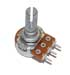
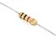

# BOM {#bom}

Here you can find a template for a BOM list.
This could turn particularly helpful when creating a list of the materials needed to make a project.

> The following layout requires the [`layout-tags`](https://github.com/WeMakecc/gitbook-plugin-layout-tags) plugin

It is possible to have a BOM list layout with the following markdown syntax:
```

    ../assets/pot.jpg
    10k Potentiometer (<a href="https://www.sparkfun.com/products/9939">link</a>)
    x 5



    ../assets/resistor.jpg
    100ohm Resistors
    x 10



    ../assets/capacitor.jpg
    4700uF Capacitors
    x 2

```

See result:


    ../assets/pot.jpg
    10k Potentiometer (<a href="https://www.sparkfun.com/products/9939">link</a>)
    x 5



    ../assets/resistor.jpg
    100ohm Resistors
    x 10



    ../assets/capacitor.jpg
    4700uF Capacitors
    x 2



**_IMPORTANT_** It is very important to note:
- all tags are needed to be filled and displayed, removing one of the tags would turn into a display error


# BOM table {#bom_table}

> It's also possible to achieve a similar result without using the `layout-tags` with a standard table layout:
```markdown
|Item|Description|Quantity|
|-|-|-|
||[10k Potentiometer](https://www.sparkfun.com/products/9939)|x 5|
||100ohm Resistor|x 10|
```

See result:

|Item|Description|Quantity|
|-|-|-|
||[10k Potentiometer](https://www.sparkfun.com/products/9939)|x 5|
||100ohm Resistor|x 10|


**_IMPORTANT_** It is very important to note:
- don't write any text in the alternative text section of the image as it would break the layout! (eg. please avoid the following markdown ``)
- please always try to link images with transparent background since the alternate columns have a background color 


