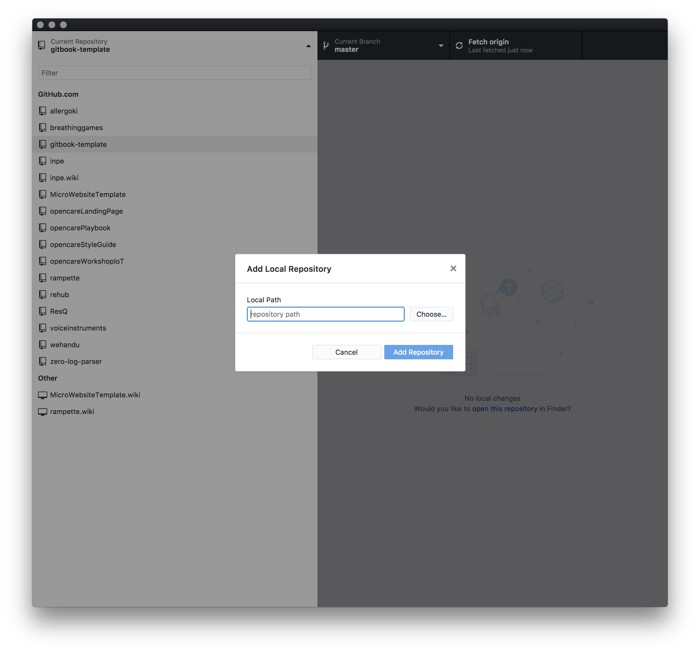

# download the template

# unzip it

# move to your git folder

# open github client and add local repo

# click on create repo

# click on publish your repo

# your repo is now published

# open the gitbook editor

# in the menu select import

# now you can edit the book using the editor

# if you want to upload it on gitbook go to gitbook.com and click on +New

# select Github from the Lists

#Select your repo

# now your book is published on gitbook

