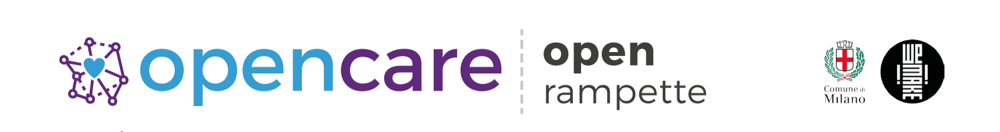

#openrampette {#openrampette}

### Cos'è
**open rampette** è un’iniziativa pilota per il **miglioramento dell’accessibilità** degli esercizi
commerciali da parte di chi deve accedere tramite rampa o scivolo.

### Beneficiari
Negozianti, cittadini e cittadine milanesi con **diverse abilità motorie**, con difficoltà di deambulazione o in sedia a rotelle.

---


   <h3>Il contesto</h3>
Dal 2015, ovvero dall'entrata in vigore
dell’articolo 77 del regolamento edilizio
del Comune di Milano, poco più del 10%
degli esercizi della città (circa 2mila su
18mila) si è adeguato alla norma che
prevede l’utilizzo di rampe mobili in
presenza di barriere architettoniche.
Da Aprile a Luglio 2017 WeMake e il
Comune di Milano hanno attivato una
sperimentazione all’interno del DUC Isola,
che mettendo insieme commercianti e
makers e portatori del bisogno di
accessibilità ha individuato,
co-progettato e realizzato soluzioni a
basso costo che consentono e migliorano
l’accessibilità alle attività commerciali
della zona alle persone con disabilità
motoria.

<h3>Descrizione</h3>
Il progetto sperimentale è partito con
degli incontri di co-progettazione che
hanno permesso l’emersione di due
ostacoli: la procedura complessa per la
regolarizzazione dell’esercizio
commerciale e il processo e il
funzionamento poco efficace del sistema
di rampa a chiamata.
Per quel che concerne la procedura è
stato rilevato un problema nel processo di
regolarizzazione che il commerciante
deve seguire. E’ stato pertanto
co-progettato un supporto passo passo
che funge da guida nella compilazione
dei documenti per comunicare e validare
con il Comune di Milano la presenza della
rampa a chiamata. Un prototipo di
mini-sito consente di inserire e
controllare i dati e fornisce il documento
compilato da presentare all’ufficio
comunale.
Per il sistema a chiamata i cittadini e le
cittadine hanno evidenziato due generi di
problemi: il campanello non è efficace
(non è visibile, non è posto all’altezza
corretta, non si sente o si rompe
facilmente).
E’ stato quindi co-progettato un device
visibile e protetto da posizionare fuori
dall’esercizio unitamente a un adesivo.
Insieme al device è stato co-progettato un
ricevitore del campanello che notifica,
con luce, suono o vibrazione, il negoziante
della richiesta di assistenza. Altro ostacolo
è rappresentato dalla mancata
informazione in merito all’accessibilità di
un esercizio. E’ stata progettata una app
per smartphone che notifica la persona
con disabilità motorie ogni volta che si
trova nei pressi di un negozio accessibile e
permette di richiedere assistenza
(suonando il campanello) tramite
smartphone.


---

### Rilascio e generatività
Replicabilità dell’azione di coprogettazione: [www.playbook.opencare.cc](http://playbook.opencare.cc)

Descrizione del progetto: [www.rampette.opencare.cc](http://rampette.opencare.cc)

Repository del progetto: [www.github.com/opencarecc/rampette/wiki](http://www.github.com/opencarecc/rampette/wiki)

> ### Team
> Costantino Bongiorno, Alessandro Contini, Lorenzo Romagnoli, Ivo Pionna, Valeria Loreti.
> Silvia D'Ambrosio, Chiara Ferrero, Francesco Perego, Andrea Biffi, Cristina Martellosio e
Zoe Romano.